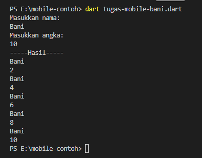

# Program Validasi Password

Program ini dibuat menggunakan Dart dan berfungsi untuk memvalidasi password yang dimasukkan oleh pengguna.

## Prerequisites

Pastikan Anda telah menginstal Dart SDK sebelum menjalankan program ini.

## Cara Menjalankan

1. Clone repositori ini ke mesin lokal Anda.
2. Buka terminal dan arahkan ke direktori repositori yang telah di-clone.
3. Jalankan program dengan perintah berikut:
4. Masukkan password yang ingin Anda validasi saat diminta.
5. Program akan menampilkan pesan sesuai dengan persyaratan password yang telah ditentukan.

## Kriteria Password

Password harus memenuhi kriteria berikut:

- Minimal 6 karakter
- Minimal 1 huruf kapital
- Minimal satu karakter khusus (!, @, #, $, &, \*, .)

## Contoh Penggunaan

